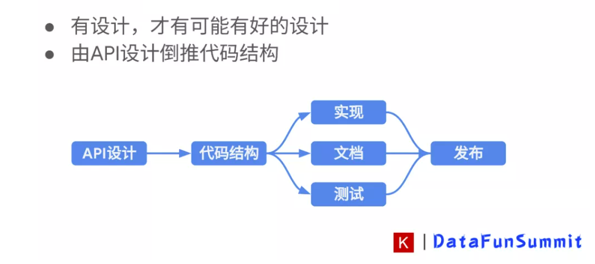
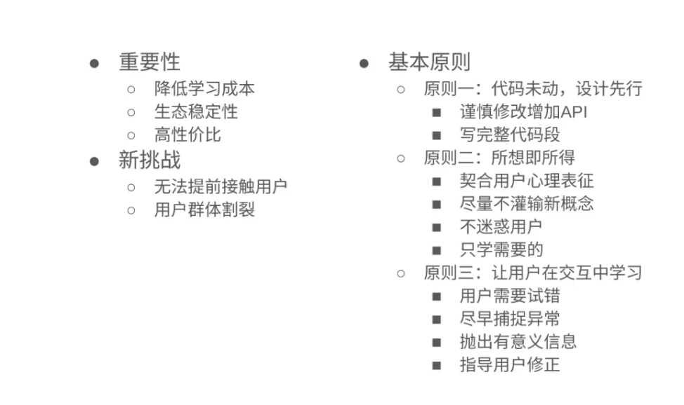
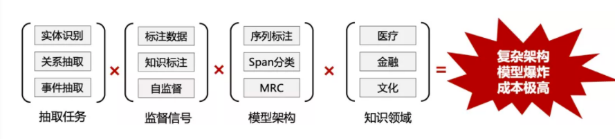

[训练可视化工具哪款是你的菜？MMCV一行代码随你挑](https://mp.weixin.qq.com/s/adMGb6y9oRS-LaLAKvFGKg)

[深度学习图像分类任务中那些不得不看的技巧总结](https://mp.weixin.qq.com/s/rhLlQwSJavjCIUa9GLxjSA)

https://www.xfyun.cn/service/formula-discern?ch=bd23-01&bd_vid=10704961911951465930

# api功能要求
文字&公式混合识别
支持同时对图片中的文字和公式进行识别，实现题目电子化

手写体&印刷体识别
支持对印刷体、手写体文字及公式的识别，返回可编辑的 Latex结果

自动定位识别
自动定位图片中题目的位置，提供文字和公式在图片中的位置信息

识别准确率高
基于有道的海量数据和精深的深度学习技术，保证高准确性

识别速度快
海量并发支持实时识别，单图毫秒级响应。提供业界领先的公式识别服务

技术成熟领先
利用有道深度学习技术及海量数据不断优化算法迭代模型，提高服务质量

服务安全稳定
提供24小时云端高稳定服务，服务可用性高，满足到企业机构对安全性的要求

接入形式灵活
支持多种设备和操作系统，提供全平台API调用方式和Android/iOS SDK接入形式

#jupyter
IPython的几个常用的魔法命令：

魔术命令	作用
%pwd	查看当前的工作目录
%cd	更改当前的工作目录
%ls	查看目录文件列表
%writefile	写入文件
%run	运行脚本；％run可以从.py文件中执行python代码，也可以指定ipynb文件
%whos	查看当前变量
%reset	清楚当前变量
%timeit	测试单行代码运行时间
%hist	打印命令输入历史
%paste	从剪贴板中执行已经预先格式化的Python代码
%cpaste	打开一个提示符，手动粘贴执行的python代码
%debug	从最后发生报错的底部进入交互式调试器

1、命令模式快捷键（按 Esc 键开启）:

命令模式将键盘命令与Jupyter Notebook笔记本命令相结合，可以通过键盘不同键的组合运行笔记本的命令。
按esc键进入命令模式。
命令模式下，单元格边框为灰色，且左侧边框线为蓝色粗线条。
快捷键	作用
Enter	转入编辑模式
Shift-Enter	运行本单元，选中下个单元
Ctrl-Enter	运行本单元
Alt-Enter	运行本单元，在其下插入新单元
Y	单元转入代码状态
M	单元转入 markdown 状态
R	单元转入 raw 状态
1、2、6	设定 1 、2、6级标题
Up	选中上方单元
K	选中上方单元
Down	选中下方单元
J	选中下方单元
Shift-K	连续选择上方单元
Shift-J	连续选择下方单元
A	在上方插入新单元
B	在下方插入新单元
X	剪切选中的单元
C	复制选中的单元
Shift-V	粘贴到上方单元
V	粘贴到下方单元
Z	恢复删除的最后一个单元
D,D	删除选中的单元
Shift-M	合并选中的单元
Ctrl-S	保存当前 NoteBook
S	保存当前 NoteBook
L	开关行号
O	转换输出
Shift-O	转换输出滚动
Esc	关闭页面
Q	关闭页面
H	显示快捷键帮助
I,I	中断 NoteBook 内核
0,0	重启 NoteBook 内核
Shift	忽略
Shift-Space	向上滚动
Space	向下滚动
2、编辑模式快捷键（ 按 Enter 键启动）

编辑模式使用户可以在单元格内编辑代码或文档。
按enter或return键进入编辑模式。
编辑模式下，单元格边框和左侧边框线均为绿色。
快捷键	作用
Tab	代码补全或缩进
Shift-Tab	提示
Ctrl-]	缩进
Ctrl-[	解除缩进
Ctrl-A	全选
Ctrl-Z	撤销
Ctrl-Shift-Z	重做
Ctrl-Y	重做
Ctrl-Home	跳到单元开头
Ctrl-Up	跳到单元开头
Ctrl-End	跳到单元末尾
Ctrl-Down	跳到单元末尾
Ctrl-Left	跳到左边一个字首
Ctrl-Right	跳到右边一个字首
Ctrl-Backspace	删除前面一个字
Ctrl-Delete	删除后面一个字
Esc	切换到命令模式
Ctrl-M	切换到命令模式
Shift-Enter	运行本单元，选中下一单元
Ctrl-Enter	运行本单元
Alt-Enter	运行本单元，在下面插入一单元
Ctrl-Shift–	分割单元
Ctrl-Shift-Subtract	分割单元
Ctrl-S	保存当前 NoteBook
Shift	忽略
Up	光标上移或转入上一单元
Down	光标下移或转入下一单元
Ctrl-/	注释整行/撤销注释

### 信息抽取当前也面临不少挑战
任务多样、结构复杂，需要特定的建模方式

领域繁多，需要单独定制

模型相互独立、构建成本高

export PATH=$PATH:/opt/conda/bin 
