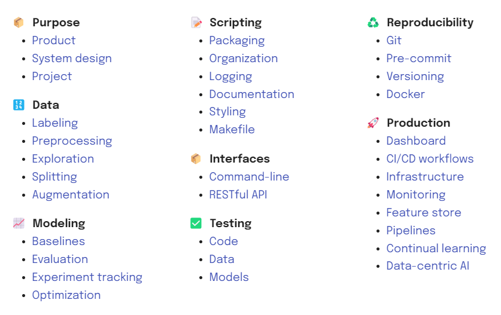

# 起源

写这篇博客的原因，是在做大量AI相关训练中，每当出现指标效果提不上去时，我们常常思考
的角度是优化模型，但是深度学习的模型是黑盒，如何在工业界可控指标效果，我思考的一个角度就是
从AI整体落地的各个环节流程中可量化，而不是期望模型的黑盒效果。

为算法devops每个流程加上可使用的工具

# 整体概览



# Project Management for Machine Learning

Product (What & Why) → System design (How) → Project (Who & When)

**为什么要做技术设计**
明确问题和目标

- 上一版本遗留的问题，那这个版本就需要解决。

- 产品或者其他提出的功能需求。

- 算法效果的需求，例如准确率召回率双90%。

- 其他的优化要求，例如要求原来好的结果不能变差。

- 工程上的性能需求，这个很隐性，但是有经验的算法工程师都需要关注。

- 代码和架构上的需求，例如一些可拓展性、可维护性的需求。

现状和资源的确定

- 数据。算法，尤其是用到深度学习的算法，对数据是多少一些需要的，至少要有评测集吧。

- 机器。算法的执行依赖及其环境，如果机器环境不好，例如内存不行，没有GPU，那我们是需要考虑更加轻便的算法方案了。

方案调研

- 这个方案的baseline是什么，最简单和快捷的方式是哪些，都有什么优缺点。

- 大厂常用的方案是什么，有没有什么特别地操作，为什么要做这个操作。

- 论文，科研界的主要方式是什么，需要关注哪些方面。
  
  技术方案的筛选

- 各种方法会有什么优缺点，与现有资源是否匹配。

- 时间上的效率分析。

- 开发难度和风险，考虑下是否会出现类似在线问题、项目延期等风险。

- 和上下游对好接口，确认接口协议，有些数是否好给，例如用的规则，类似打分的方法就要仔细考虑下了。

## 方案的详细设计

### 算法设计

算法代码架构框架 [pytorch-template](https://github.com/victoresque/pytorch-template)

### 工程设计

- 算法模块在整个流程中的角色是什么，上下游接口怎么样。

- 数据流是怎么走的，需要确认，包括离在线，搜索系统的话不仅考虑用户query等信息，还有物料的信息怎么存储，另外如果个性化，还有用户画像的数据问题。

- 中间件的使用和维护，如常用的数据库mysql、ES、redis之类的，还有些类似kafka、hadoop全家桶之类的。

复现可借鉴的算法方案

1. ## 熟悉数据
   
   > 模型是数据的浓缩版----*Andrew NG的二八定律，即80%的数据+20%的=更好的AI*

2. ## **算法选型**
   
   > **在指标上太钻牛角尖**
   > 
   > **不进行相关调研，直接上SOTA算法**

3. ## 基于已有实现来优化算法
   
   > 对于某个任务在选择好合适的算法以后，如果有相应的效果比较好的开源实现，最好用开源项目进行算法的复现。
   > 
   > 改进模型:
   > 
   > > 1. 代码是否实现了文章一些涨点的trick，如果没有可以尝试
   > > 
   > > 2. 文章一般会分析实验结果，后面会有作者自己的一些观点，他们可能会说明为什么有些情况文章的算法效果较差
   > > 
   > > 3. 有些文章会写他们将来可能的工作，这也是一个改进思路
   > > 
   > > 4. 需要可视化查看实验结果（特别是跑自己的数据集），结果可能与作者在公开数据集展示出的问题不一样，分析效果差的原因

4. ## 从0复现算法(checklist 表)
   
   > 1. 尽量测试每一个细节，从数据接口，模型，到loss输出，到最终的评测代码。保证每个部分都可控。
   > 
   > 2. 测试数据接口，从单进程，batch为1开始，方便打印数值进行对比。
   > 
   > 3. 不要随意的去随机，尽量保证问题可以复现比如先不要加入随机数据增强，模型的随机种子固定。
   > 
   > 4. 用少量的数据，这样可以快速的做实验，也可以让模型快速过拟合。模型能过拟合可以大概确定模型是可以学到点什么的。
   > 
   > 5. 尽量按照原文来复现，在复现前，先不要过多的添加自己独特的想法。比如训练参数，模型backbone，数据增强方式等等先按照文章来。不清楚的点可以尝试email作者或者寻找相关圈子讨论。
   > 
   > 6. 日志打印全，比如解loss为nan的情况，需要知道是forward的导致还是bp导致。
   
   

# Data Labeling

## Intuition

It's not just about identifying and labeling our initial dataset. What else can we learn from it?

> - augment the training data split
> - enhance using auxiliary data
> - simplify using constraints 
> - remove noisy samples 
> - figure out where labeling process can be improved （算法工程师不要吝啬时间，自己要手把手标dozen数量的样本，能从中得到许多算法方案的灵感）

## Process步骤

### Preliminary steps

### Workflow setup 建立标注工作流

#### 1.Iterative setup

Implement strategies to reduce labeling efforts
determine subsets of the data to label next using active learning

> 1. Label a small, initial dataset to train a model.
> 2. Ask the trained model to predict on some unlabeled data.
> 3. Determine which new data points to label from the unlabeled data based on:
>    - entropy over the predicted class probabilities
>    - samples with lowest predicted, [calibrated](https://arxiv.org/abs/1706.04599), confidence (uncertainty sampling)
>    - discrepancy in predictions from an ensemble of trained models
> 4. Repeat until the desired performance is achieved.

auto-label entire or parts of a data point using weak supervision

>  [labeling functions](https://www.snorkel.org/use-cases/01-spam-tutorial)

focus constrained labeling efforts on long tail of edge cases over time

## Datasets

### Load data

project要标上 title, description and tags，用json文件来组织数据，airflow或者kubeflow piplines来流程化数据处理逻辑

### Auxiliary data

### Data imbalance

## Libraries 标注工具

What criteria should we use to evaluate what labeling platform to use?

> - how easy is it to connect to our data sources (DB, QA, etc.)?
> - how easy was it to make changes (new features, labeling paradigms)?
> - how securely is our data treated (on-prem, trust, etc.)

# Data Preprocessing

## Preparing

### Joins

> SELECT * FROM A
> INNER JOIN B on A.id == B.id

### Missing values

### Outliers (anomalies)

### Feature engineering

### Cleaning

## Transformations

### Scaling

### Encoding

### Extraction

## Application

## Feature engineering

## Filtering

## Cleaning

# Exploration

# Data Augmentation

> **Split the dataset**
> 
> **Augment the training split**
> 
> **Inspect and validate**

## Libraries 工具库

1. Natural language processing (NLP)

2. Computer vision (CV)

3. other 综合类
   
   1. - [Snorkel](https://github.com/snorkel-team/snorkel): system for generating training data with weak supervision.
      - [DeltaPy⁠⁠](https://github.com/firmai/deltapy): tabular data augmentation and feature engineering.
      - [Audiomentations](https://github.com/iver56/audiomentations): a Python library for audio data augmentation.
      - [Tsaug](https://github.com/arundo/tsaug): a Python package for time series augmentation.

# Modeling

## Modeling Baselines

### Process 构建baseline模型的过程

1. Start with the simplest possible baseline to compare subsequent development with. This is often a random (chance) model.
2. Develop a rule-based approach (when possible) using IFTTT, auxiliary data, etc.
3. Slowly add complexity by *addressing* limitations and *motivating* representations and model architectures.
4. Weigh *tradeoffs* (performance, latency, size, etc.) between performant baselines.
5. Revisit and iterate on baselines as your dataset grows.

tradoff 模型选型

- `performance`: consider coarse-grained and fine-grained (ex. per-class) performance.
- `latency`: how quickly does your model respond for inference.
- `size`: how large is your model and can you support it's storage.
- `compute`: how much will it cost ($, carbon footprint, etc.) to train your model?
- `interpretability`: does your model need to explain its predictions?
- `bias checks`: does your model pass key bias checks?
- `time to develop`: how long do you have to develop the first version?
- `time to retrain`: how long does it take to retrain your model? This is very important to consider if you need to retrain often.
- `maintenance overhead`: who and what will be required to maintain your model versions because the real work with ML begins after deploying v1. You can't just hand it off to your site reliability team to maintain it like many teams do with traditional software.

## Distributed training

**data parallelism**

**model parallelism**

## Optimization

[**Pruning**](https://pytorch.org/tutorials/intermediate/pruning_tutorial.html)

[**Quantization**](https://pytorch.org/docs/stable/torch.quantization.html)

[**Distillation**](https://arxiv.org/abs/2011.14691)


# Evaluating ML Models

## Confusion matrix

> 列出FP，FN的样例，便于分析badcase
> 
> ```
> # Samples
> num_samples = 3
> if len(tp):
>     print ("\n=== True positives ===")
>     for i in tp[:num_samples]:
>         print (f"  {X_test_raw[i]}")
>         print (f"    true: {label_encoder.decode([y_test[i]])[0]}")
>         print (f"    pred: {label_encoder.decode([y_pred[i]])[0]}\n")
> if len(fp):
>     print ("=== False positives === ")
>     for i in fp[:num_samples]:
>         print (f"  {X_test_raw[i]}")
>         print (f"    true: {label_encoder.decode([y_test[i]])[0]}")
>         print (f"    pred: {label_encoder.decode([y_pred[i]])[0]}\n")
> if len(fn):
>     print ("=== False negatives ===")
>     for i in fn[:num_samples]:
>         print (f"  {X_test_raw[i]}")
>         print (f"    true: {label_encoder.decode([y_test[i]])[0]}")
>         print (f"    pred: {label_encoder.decode([y_pred[i]])[0]}\n")
> ```

## Confidence learning

> - **Categorical**
>   - prediction is incorrect (also indicate TN, FP, FN)
>   - confidence score for the correct class is below a threshold
>   - confidence score for an incorrect class is above a threshold
>   - standard deviation of confidence scores over top N samples is low
>   - different predictions from same model using different/previous parameters
> - **Continuous**
>   - difference between predicted and ground-truth values is above some %
> - 

# 

## Calibration

## Manual slices

## Generated slices

### Hidden stratification

### Model patching

## Explainability

## Counterfactuals

## Behavioral testing黑盒测试

> - What criteria are most important?
> - What criteria can/cannot regress?
> - How much of a regression can be tolerated?

对于NLP任务，参考”Beyond Accuracy: Behavioral Testing of NLP Models”

模型能力：What to test：capabilities


How to test

1）最小功能测试（MFT）

2）不变性测试（INV）

3）定向期望测试（DIR）

## Evaluating evaluations

# Experiment Tracking

## Tools

## Application

## Training

## Tracking

## Viewing

## Loading

# Optimizing Hyperparameters

超参数调优，首先得确定是否是分布式，再确定用哪些开源工具

# Scripting

# Packaging a Python Codebase

# Organizing Machine Learning Code

## Editor

## Organizing

```
tagifai/
├── data.py       - data processing utilities
├── eval.py       - evaluation components
├── main.py       - training/optimization operations
├── models.py     - model architectures
├── predict.py    - inference utilities
├── train.py      - training utilities
└── utils.py      - supplementary utilities
```

### Utilities

### Operations

## Config

# Logging for ML Systems

参考loger.py  

# Documenting Code

> - `comments`: short descriptions of why a piece of code exists.
> - `typing`: specification of a function's inputs and outputs data types, providing insight into what a function consumes and produces at a quick glance.
> - `docstrings`: meaningful descriptions for functions and classes that describe overall utility as well as arguments, returns, etc. (尽量在函数定义变量名后面加上类型）
> - `documentation`: rendered webpage that summarizes all the functions, classes, API calls, workflows, examples, etc. so we can view and traverse through the code base without actually having to look at the code just yet.

# Styling and Formatting Code

参考.pre-commit-config.yaml

# Makefiles

# Command Line Interface (CLI) Applications

# APIs for Machine Learning

# Testing

# Testing Machine Learning Systems: Code, Data and Models

> 1. `Unit tests`: tests on individual components that each have a [single responsibility](https://en.wikipedia.org/wiki/Single-responsibility_principle) (ex. function that filters a list).
> 
> 2. `Integration tests`: tests on the combined functionality of individual components (ex. data processing).
> 
> 3. `System tests`: tests on the design of a system for expected outputs given inputs (ex. training, inference, etc.).
> 
> 4. `Acceptance tests`: tests to verify that requirements have been met, usually referred to as User Acceptance Testing (UAT).
> 
> 5. `Regression tests`: testing errors we've seen before to ensure new changes don't reintroduce them.
>    
>    命名test时，名字细分这些类别


## Best practices

> - `atomic`: when creating unit components, we need to ensure that they have a [single responsibility](https://en.wikipedia.org/wiki/Single-responsibility_principle) so that we can easily test them. If not, we'll need to split them into more granular units.
> - `compose`: when we create new components, we want to compose tests to validate their functionality. It's a great way to ensure reliability and catch errors early on.
> - `regression`: we want to account for new errors we come across with a regression test so we can ensure we don't reintroduce the same errors in the future.
> - `coverage`: we want to ensure that 100% of our codebase has been accounter for. This doesn't mean writing a test for every single line of code but rather accounting for every single line (more on this in the [coverage section](https://madewithml.com/courses/mlops/testing/#coverage) below).
> - `automate`: in the event we forget to run our tests before committing to a repository, we want to auto run tests for every commit. We'll learn how to do this locally using [pre-commit hooks](https://madewithml.com/courses/mlops/git/#pre-commit) and remotely (ie. main branch) via GitHub actions in subsequent lessons.

## Test-driven development

## Application

## Pytest

### Coverage


## Data

### Projects

### Data docs


### Best practices


## Models

### Training

> Check shapes and values of model output
> 
> ```
> assert model(inputs).shape == torch.Size([len(inputs), num_classes])
> ```
> 
> Check for decreasing loss after one batch of training
> 
> Overfit on a batch
> 
> Train to completion (tests early stopping, saving, etc.)
> 
> On different devices

### Behavioral testing

 [Beyond Accuracy: Behavioral Testing of NLP Models with CheckList](https://arxiv.org/abs/2005.04118)

### Inference

### Deployment

# Reproducibility

# Git

# Pre-commit

参考 .pre-commit-config.yaml

# Versioning Code, Data and Models


## Operations

**Version the data**

**Version the operations**

# Docker

# Production

# Dashboard

# CI/CD for Machine Learning

## GitHub Actions


## Components


# Infrastructure

## Serving

### Batch serving

### Real-time serving

## Processing

### Batch processing


### Stream processing


## Learning

### Offline learning


### Online learning


## Experimentation

### AB tests


### Canary tests


### Shadow tests


## Methods

### Compute engines

### Container orchestration

### Serverless

# Monitoring Machine Learning Systems

## System health

## Performance

## Delayed outcomes

## Importance weighting

## Drift


### Data drift

### Target drift

### Concept drift

## Locating drift

> - **reference window**: the set of points to compare production data distributions with to identify drift.
> - **target window**: the set of points to compare with the reference window to determine if drift has occurred.

## Measuring drift

### Expectations

### Univariate

### Multivariate

#### Dimensionality reduction

#### Two-sample tests

## Outliers

## Solutions

### Alert

### Inspect

## Production


# Feature Store

> - **data ingestion**: ability to ingest data from various sources (databases, data warehouse, etc.) and keep them updated.
> - **feature definitions**: ability to define entities and corresponding features
> - **historical features**: ability to retrieve historical features to use for training.
> - **online features**: ability to retrieve features from a low latency origin for inference.

## Feast


## Architecture

### Batch processing


### Stream processing


# Pipelines

> - **trigger** or **schedule** these workflows as new data arrives?
> - **scale** these workflows as our data grows?
> - **share** these workflows so others can use their outputs?
> - **monitor** these workflows individually?

## kuberflow 实践


## DataOps


## MLOps (model)


## MLOps (update)


# Continual learning


## Data-centric AI


# 参考资料

[Made With ML](https://madewithml.com/courses/mlops/product/)

https://mp.weixin.qq.com/s?__biz=MzIzMzYwNzY2NQ==&mid=2247486995&idx=1&sn=a3771b94c67db3f4ff518e52effd9221&chksm=e882568ddff5df9be7e9873e0262a5d440ed3ce4117804d49fe3b47b031cfe61665f14307b3c&scene=21#wechat_redirect

[PyTorch常用代码段合集](https://zhuanlan.zhihu.com/p/59205847?)
[数据分析和机器学习高频使用代码集锦](https://mp.weixin.qq.com/s?__biz=MzIwODI2NDkxNQ==&mid=2247503049&idx=2&sn=64485c6c80024a2cc73535357082de6f&chksm=97074775a070ce635708549545530f1e781ec64a6e487c62750bd5b94132ec2ca3726a43dae1&mpshare=1&scene=24&srcid=0516AaSMcGN0GFPdddGKJ5Dh&sharer_sharetime=1652678577229&sharer_shareid=9b4e10fbcc6e8939ea6b084e4ebbe34d#rd)
